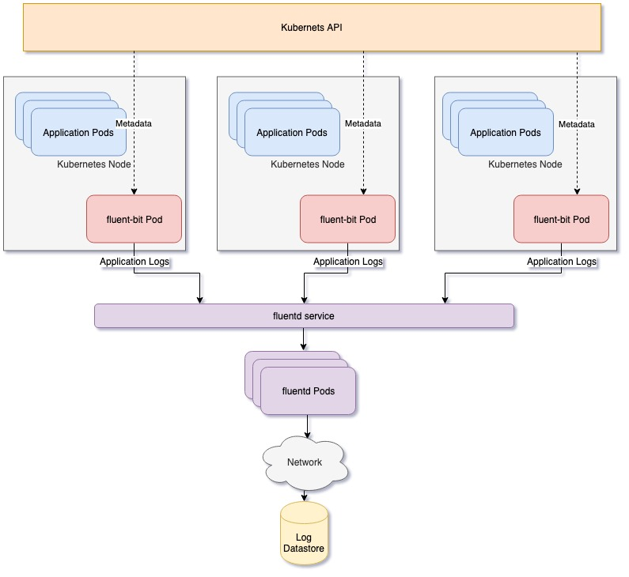

### Log pipeline management for Kubernetes ###
Logging operator provides Kubernetes native log pipeline management for developers and devops teams. Main benefits are:

* Design log pipelines using Kubernetes constructs. No need to learn log configurations.
* Flexibility and Reuse through Kubernetes Custom Resource Definitions.
* Namespace support: Users in each namespace can deploy logging pipelines separately 
* Handles logging service deployment and scaling.
* Support for popular datastores like ElasticSearch and S3

#### Concepts ####
1. ***Pipeline***: A pipeline defines stages of processing logs of a Kubernetes application. It describes the collection, formatting, filtering and storage of logs from a group of applications.
2. ***Source***: A source describes a group of applications to collect logs from and feed into the pipeline. This selection is dynamic and uses Kubernetes labels to identify candidates to collect logs from. The log collection can be made more/less granular by using appropriate label selector expressions
3. ***Format***: A format describes a regular expression to help parse log messages from a source and create structured record. Every source must have a type associated with it. The operator comes with built-in types: nginx, apache2, json or none.
4. ***Filter***: A filter can drop log messages or add/update/remove tags associated with log messages.
5. ***Output***: An output defines a datastore where logs are to be stored. Currently, the operator supports ElasticSearch and S3 as log stores.

Each of the above concepts has a correpsonding Custom Resource defined with deployment of the operator

#### Architecture ####
Logging operator uses fluent-bit and fluentd for collection and processing of logs respectively. The fluent-bit component is deployed as daemonset and is present on each node. Its main function is log formatting and filtering. fluentd is used as aggregator and buffer. It ships logs to chosen datastore. The fluentd layer can scale per log traffic.




#### Install ####

#### Example Usage ####
1. Deploy nginx pod from Kubernetes example repo:
```
kubectl apply -f https://raw.githubusercontent.com/kubernetes/website/master/content/en/examples/application/deployment.yaml
```
2. Notice that the deployment labels pods as app: nginx. Create a source object accordingly
```yaml
apiVersion: logging.pf9.io/v1alpha1
kind: Source
metadata:
  name: frontend
spec:
    selector:
        app: nginx
    format: nginx
```
3. Create a filter which removes nginx access logs on unknown path like test
```yaml
apiVersion: logging.pf9.io/v1alpha1
kind: Filter
metadata:
  name: drop_test
spec:
  type: exclude
  key: path
  pattern: ^/test/
```

4. Lets say we have ElasticSearch service available at http://10.4.252.9:9200. Also, lets create a secret named es-creds with fields username and password which specify credentials to elasticsearch. Now lets define an output object with it.
```yaml
apiVersion: logging.pf9.io/v1alpha1
kind: Output
metadata:
  name: es-cluster
spec:
  params:
    - name: host
      value: 10.4.252.9
    - name: port
      value: 9200
    - user:
      valueFrom:
        secretKeyRef:
          name: es-creds
          key: username
    - password:
      valueFrom:
        secretKeyRef:
          name: es-creds
          key: password
```

5. Finally, lets create a pipeline to bridge all these components together
```yaml
apiVersion: logging.pf9.io/v1alpha1
kind: Pipeline
metadata:
 name: nginx-log-processor
spec:
 source: frontend
 filters:
 - drop-test
 output: es-cluster
```